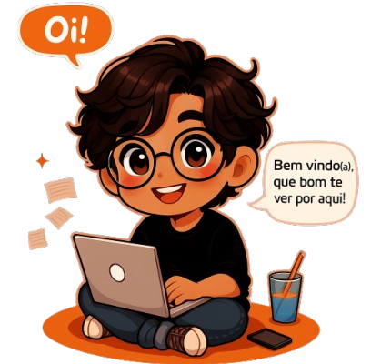

<!-- Banner -->
<h1 align="center">✨ Olá, Mundo! ✨</h1>

  

<h2 align="center">Eu sou o Pedro de Souza 👨‍💻 | Front-end Developer & Estudante de Engenharia de Software</h2>

---

<!-- Gif de boas-vindas -->

  

---

### 😎 Quem sou eu?
- 🚀 Desenvolvedor Web apaixonado por transformar ideias em **interfaces incríveis**
- 🎓 Estudante de **Engenharia de Software** na UEPA
- 🐉 Criativo, curioso e sempre pronto para novos desafios
- 🎮 Gamer de coração, mas também dev que vira madrugadas no código
- 💡 Meu lema: *“Se não existe solução pronta, eu crio uma.”*  

---

### 📊 Estatísticas do GitHub

 <!--   --> 

---

### 🛠️ Tecnologias & Ferramentas

  

---

### 🐉 Um pouco mais sobre mim
> *"Eu não sou só um dev, sou um construtor de ideias."*  

- 💭 Gosto de imaginar sistemas como **mundos vivos**, cheios de lógica e conexões  
- 🎨 Tenho apreço pelo design, mas **não abro mão da performance**  
- 🛠️ Adoro criar **projetos pessoais** que misturam tecnologia com criatividade  
- 📖 Estou sempre aprendendo novas linguagens e frameworks  
- 🧩 Quando não estou codando, provavelmente estou:  
  - Jogando 🎮  
  - Lendo novels📚  
  - Escrevendo algo ✍️  
  - Ou simplesmente tomando café ☕  

---

  

---

### 📬 Onde me encontrar

  
  
  
  

---

### 🎉 Extra

  
    
  <i>"Keep coding, keep dreaming."</i> ✨

